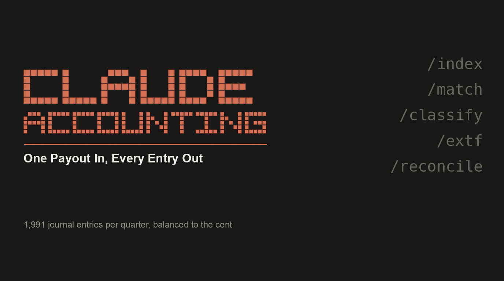

<p align="center">
  
</p>

<h3 align="center">Your payment provider sends one bank transfer. Your accountant needs every transaction inside it.</h3>

<p align="center">
  
  
  
  
  
</p>

---

Stripe does not pay out per sale. It collects, subtracts fees, refunds and chargebacks, and
wires you what is left. Your bank statement shows one line for 84,488.41 EUR. Behind it sit
several hundred transactions in a handful of currencies.

Bookkeeping needs each of them on its own. Revenue, fee, tax rate, country, date. Without
that split, neither the VAT return nor the P&L is correct.

I wrote this after the software built for the job could not do it, and the vendor ran out
of ideas somewhere between the support thread and the second screen share. One quarter came
out as **1,991 journal entries** across three DATEV EXTF batches, ready to import.

| Month | Entries |
|---|---:|
| April 2026 | 382 |
| May 2026 | 796 |
| June 2026 | 813 |
| **Total** | **1,991** |

## Install

```bash
git clone https://github.com/nicojunk/claude-accounting
cd claude-accounting
cp accounting.example.json accounting.json      # your accounts and tax keys
cp skill/vendors.example.json vendors.json      # 53 common vendors to start from
python3 tests/test_extf.py                      # 14 tests, all should pass
```

Needs `pdftotext` from poppler (`brew install poppler`). No API keys, no accounts, no
network access.

As a Claude Code skill, copy `skill/` into your skills directory. It then answers to
requests about payout reconciliation, DATEV exports and matching receipts to bank
transactions.

## How it works

```
index_documents.py      Read every invoice PDF and record issuer, amounts, dates,
                        currency. From the text inside the file, never the folder.
   ↓
match_transactions.py   Match bank transactions to documents. Exact amount and a
                        date window for EUR, a narrow FX corridor for anything else.
                        Each document can be claimed once. Ties stay unresolved.
   ↓
build_extf.py           Split the payout into journal entries, apply revenue, fee and
                        refund accounts, tax key per country, write cp1252 EXTF.
   ↓
reconcile               Sum of entries == the payout on the statement.
                        Off by a cent, nothing gets written.
```

That last step is the point. Nobody finds a bad row in 1,991 by reading them, so the check
has to be mechanical and it has to block.

## Why booking the payout as one line does not work

**VAT follows the buyer, not the payout.** A sale to Austria and a sale to Germany land in
the same transfer and need different tax keys. Book them together and the OSS return cannot
be produced at all.

**Fees are an expense, not less revenue.** Net booking shrinks revenue and costs at the
same time, so the P&L is wrong in both directions, which is worse than being wrong in one.

**Refunds and chargebacks travel in the same envelope.** They belong on their own accounts,
often in a different period than the sale they reverse.

## Things that cost real money

Full write-up in [skill/references/PITFALLS.md](skill/references/PITFALLS.md). Every entry
there is a bug that shipped, or came within a day of shipping. The short version:

Write umlauts, the format takes them. Transliterating "Erlös" defensively produced 1,991
wrong booking texts once, silently. A document can only be claimed once, or two charges of
the same amount on the same day quietly become a double booking. Foreign currency needs a
narrow FX window: opening it from 0.84-0.87 to 0.82-0.95 matched a July invoice to a June
charge on the arithmetic alone. Amounts and dates are not keys. Folder names are not
evidence: 299 of 684 documents sat in the wrong vendor folder. And a lot of invoices are
not files at all, 329 in one quarter existed only in an email body.

## Configuration

See [CONFIGURATION.md](CONFIGURATION.md). Two JSON files, both copied from an example,
neither in version control. Account numbers and tax keys come from your accountant, they
depend on your chart of accounts.

## What is not in here

No credentials, no client numbers, no bank accounts, no customer data, no vendor list from
anyone's actual books. This is the method and the guards, not somebody's ledger.

## License

MIT
